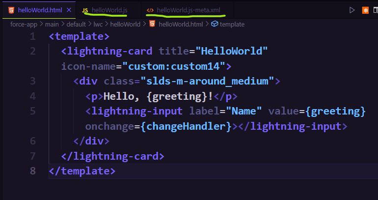
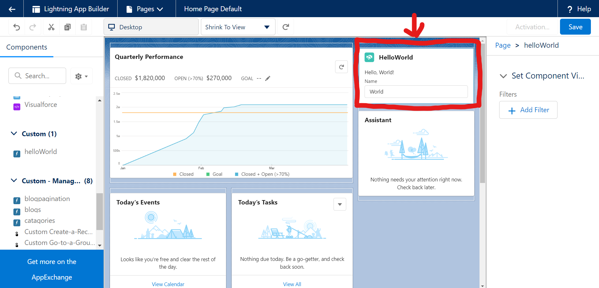
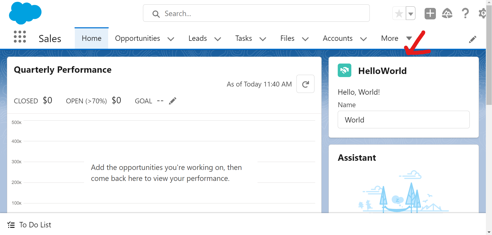

# Salesforce DX Project: Quick Start: Lightning Web Components

This is the first of many Lightning Web Components that will be built for Salesforce.


## Configure Your Salesforce DX Project

The `sfdx-project.json` file contains useful configuration information for your project. See [Salesforce DX Project Configuration](https://developer.salesforce.com/docs/atlas.en-us.sfdx_dev.meta/sfdx_dev/sfdx_dev_ws_config.htm) in the _Salesforce DX Developer Guide_ for details about this file.


### Instructions

You can get instructions and the code for the **```HTML```, ```JS```** and **```XML```** files for this component in this [Trailhead Module](https://trailhead.salesforce.com/content/learn/projects/quick-start-lightning-web-components/create-a-hello-world-lightning-web-component).



### Successful Component

Once component is pushed to org it can be added to the page using **Lightning App Builder**.

<br>
<br>
<br>

**The Lightning Web Component on the Page**


### Dependencies

- Salesforce
  - Lightning App Builder
  - Console
- VSCode
  - Salesforce Extension Pack
  - Salesforce CLI
- Git and GitHub
- Git Bash

## Other Related Documentation

- [Salesforce Extensions Documentation](https://developer.salesforce.com/tools/vscode/)
- [Salesforce CLI Setup Guide](https://developer.salesforce.com/docs/atlas.en-us.sfdx_setup.meta/sfdx_setup/sfdx_setup_intro.htm)
- [Salesforce DX Developer Guide](https://developer.salesforce.com/docs/atlas.en-us.sfdx_dev.meta/sfdx_dev/sfdx_dev_intro.htm)
- [Salesforce CLI Command Reference](https://developer.salesforce.com/docs/atlas.en-us.sfdx_cli_reference.meta/sfdx_cli_reference/cli_reference.htm)
